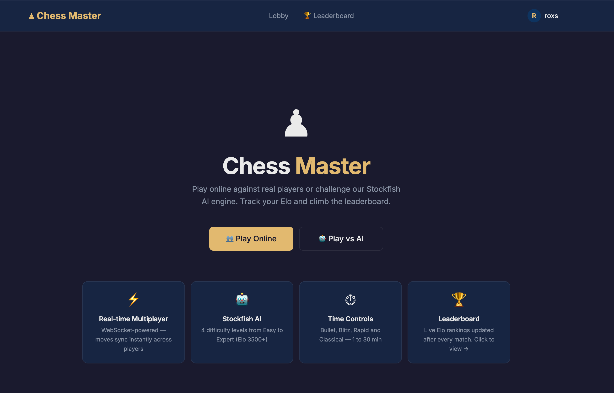
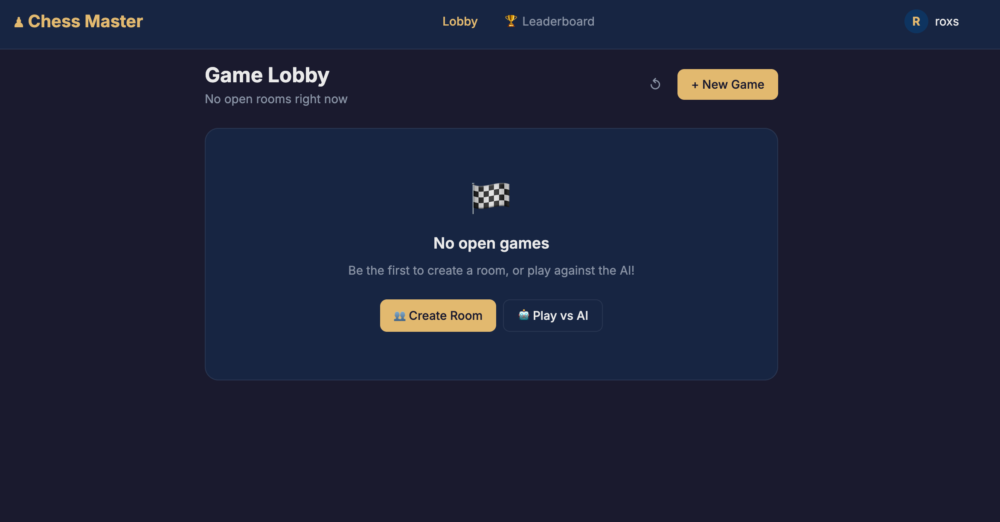
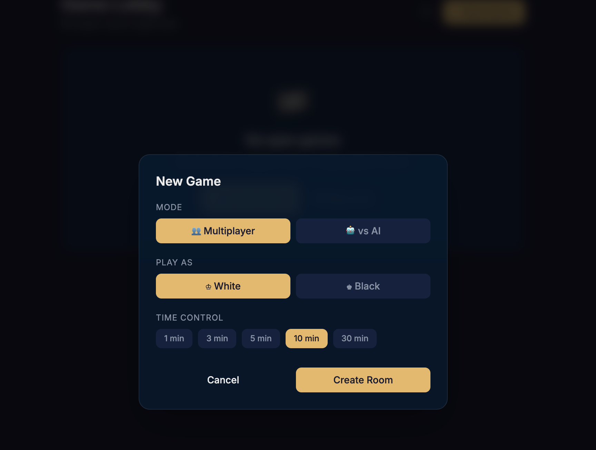
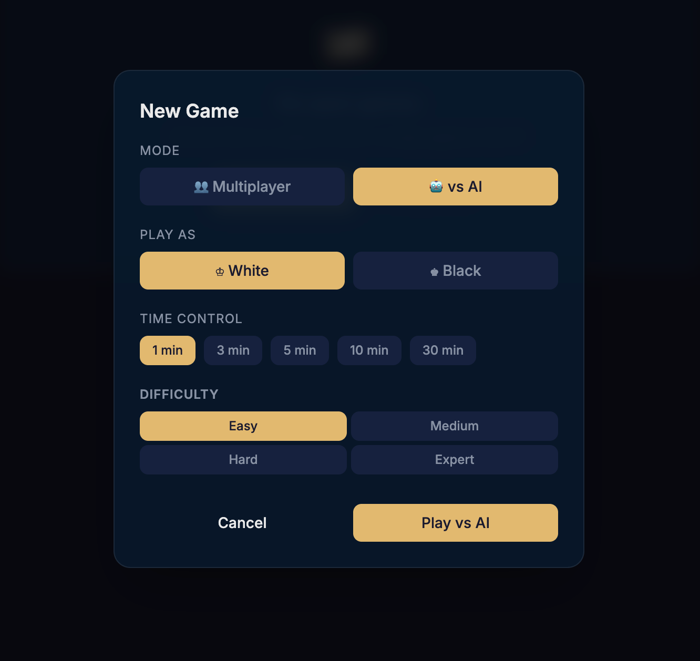
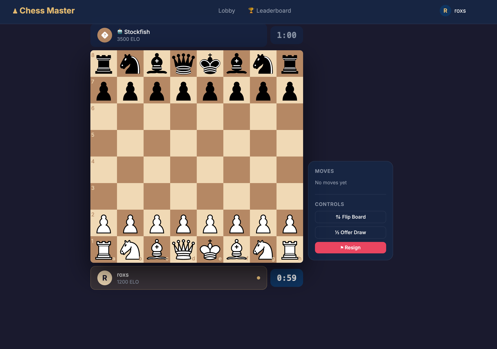
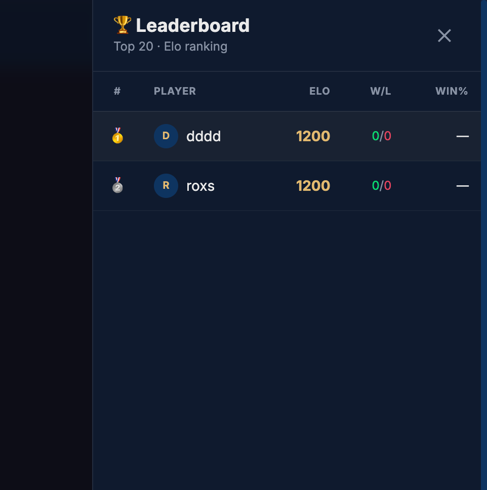
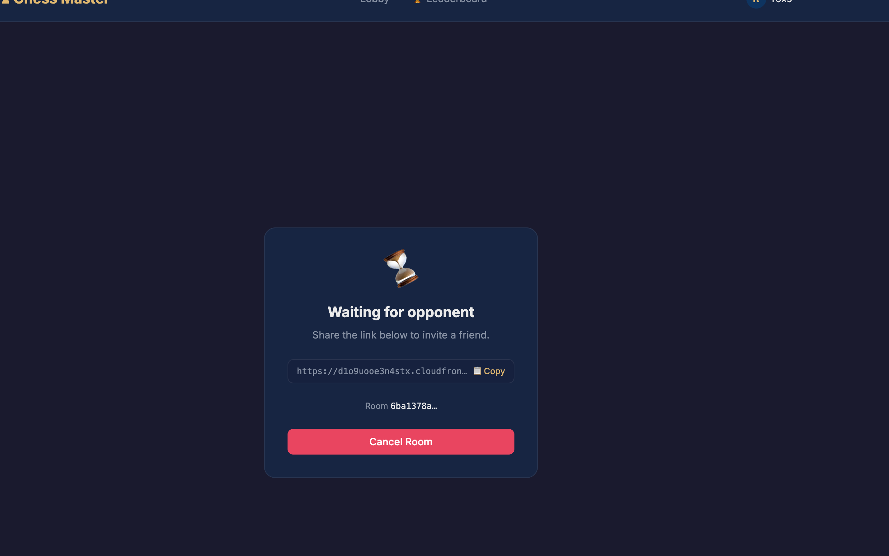

# Chess Game — Multiplayer + AI

Juego de ajedrez en tiempo real con soporte para partidas multijugador y contra IA (Stockfish). Arquitectura monorepo con frontend React y backend Node.js.

---

## Capturas de pantalla

| Portada | Lobby | Crear juego |
|---------|-------|-------------|
|  |  |  |

| Juego | Tablero | Ranking |
|-------|---------|---------|
|  |  |  |

| Multijugador |
|--------------|
|  |

---

## Tabla de contenidos

- [Arquitectura general](#arquitectura-general)
- [Flujo de la aplicación](#flujo-de-la-aplicación)
- [Frontend](#frontend)
- [Backend](#backend)
- [Motor de IA (Stockfish)](#motor-de-ia-stockfish)
- [Persistencia — DynamoDB](#persistencia--dynamodb)
- [WebSocket — Eventos](#websocket--eventos)
- [Configuración local](#configuración-local)
- [Variables de entorno](#variables-de-entorno)
- [Comandos disponibles](#comandos-disponibles)

---

## Documentación adicional

| Documento | Descripción |
|-----------|-------------|
| [`docs/DEVELOPMENT.md`](docs/DEVELOPMENT.md) | Guía completa de desarrollo: setup desde cero, cómo usar Claude Code, plugins MCP de AWS, prompts de referencia y flujos de trabajo documentados |
| [`CLAUDE.md`](CLAUDE.md) | Instrucciones técnicas para Claude Code — restricciones de arquitectura, convenciones y bugs conocidos |

---

## Arquitectura general

```
Browser                 Backend (Node.js)           AWS
┌──────────┐   HTTP     ┌──────────────────┐        ┌──────────────────┐
│ React    │ ─────────► │ Express REST      │        │ DynamoDB         │
│ Frontend │            │ /api/v1/...       │◄──────►│ chess-games      │
│          │ WebSocket  │                   │        │ chess-players    │
│          │ ◄────────► │ socket.io         │        └──────────────────┘
└──────────┘            │                   │
                        │ StockfishManager  │
                        │   └─ fork() ──►  stockfishProcess (IPC)
                        └──────────────────┘
```

- El **frontend** es una SPA estática (React + Vite) que se comunica con el backend por HTTP y WebSocket.
- El **backend** mantiene el estado de las partidas en DynamoDB y gestiona la lógica de juego en el servidor (validación de movimientos con `chess.js`).
- **Stockfish** corre como proceso hijo separado por cada partida IA activa, comunicándose con el proceso principal por IPC.

---

## Flujo de la aplicación

### 1. Landing (`/`)

El usuario elige su nombre de usuario. Este se almacena en `playerStore` (Zustand) junto con un `userId` generado en el cliente (UUID). No hay login — la identidad viaja en el handshake del WebSocket (`auth: { userId, username }`).

### 2. Lobby (`/lobby`)

Al entrar al lobby, el frontend emite `get_lobby` por WebSocket. El backend responde con la lista de salas en estado `waiting` (partidas multijugador sin oponente aún).

Desde el lobby se puede:
- **Crear sala multijugador** → `create_room` → el backend crea la partida en DynamoDB con `status: 'waiting'`, responde con `room_created` y notifica a todos los clientes con `lobby_updated`.
- **Unirse a sala** → `join_room` → el backend marca la partida como `active`, asigna colores y emite `opponent_joined` + `game_updated` al room.
- **Crear partida vs IA** → igual que crear sala pero con `isAiGame: true`. La partida se crea con `status: 'active'` directamente.

### 3. Partida (`/game/:gameId`)

Al cargar la página, el frontend emite `join_game`. El backend hace `socket.join(gameId)` (room de socket.io) y devuelve el estado actual con `game_updated`.

**Flujo de un movimiento:**

```
Player                    Backend                   Opponent
  │                          │                          │
  │── make_move ────────────►│                          │
  │                          │ chess.js valida el FEN   │
  │                          │ actualiza DynamoDB       │
  │◄──────────────────────── │── move_made ────────────►│
  │                    (si partida IA)                   │
  │                          │── Stockfish IPC ──►      │
  │                          │◄─ bestMove ──────        │
  │                          │ valida + guarda           │
  │◄──────────────────────── │── move_made ─────────── ►│
```

El servidor siempre valida los movimientos — el cliente nunca confía en su propio estado para modificar el juego.

**Fin de partida** — ocurre por:
- Jaque mate
- Tablas (stalemate, ahogado, etc.)
- Rendición (`resign`)
- Empate por acuerdo (`offer_draw` + `accept_draw`)

Cuando termina, se emite `game_over` a toda la room y el proceso de Stockfish se termina si aplica.

---

## Frontend

```
src/
├── pages/
│   ├── LandingPage.tsx      # Registro de nombre de usuario
│   ├── LobbyPage.tsx        # Lista de salas + crear partida
│   └── GamePage.tsx         # Tablero + controles en tiempo real
├── components/
│   ├── game/                # Tablero, historial, timer, controles
│   ├── lobby/               # Tarjetas de sala, modal de creación
│   ├── layout/              # Navbar, transiciones de página
│   └── ui/                  # Button, Modal, Badge, Spinner
├── store/
│   ├── gameStore.ts         # Estado de la partida activa
│   ├── lobbyStore.ts        # Lista de salas disponibles
│   └── playerStore.ts       # Identidad del jugador local
├── hooks/
│   ├── useChessGame.ts      # Lógica de UI del tablero
│   ├── useGameTimer.ts      # Temporizador por jugador
│   └── useSocket.ts         # Conexión y eventos socket.io
└── lib/
    ├── api.ts               # Cliente axios para REST
    └── socket.ts            # Instancia singleton de socket.io-client
```

**Rutas:**

| Ruta | Página |
|------|--------|
| `/` | Landing — registro de usuario |
| `/lobby` | Lobby — salas disponibles |
| `/game/:gameId` | Tablero en vivo |

---

## Backend

```
src/
├── index.ts                 # Express + socket.io + /health
├── config/env.ts            # Validación de variables de entorno (zod)
├── routes/
│   ├── games.ts             # REST /api/v1/games
│   └── players.ts           # REST /api/v1/players
├── socket/
│   ├── index.ts             # Registro de handlers
│   ├── lobbyHandler.ts      # create_room, join_room, get_lobby
│   └── gameHandler.ts       # make_move, resign, draw, sync
├── services/
│   ├── dynamodb.ts          # Wrapper DocumentClient (put/get/update/scan/delete)
│   ├── gameService.ts       # CRUD de partidas + lógica de negocio
│   └── playerService.ts     # CRUD de jugadores (upsert)
├── engine/
│   └── stockfishManager.ts  # Gestión de procesos Stockfish por gameId
├── workers/
│   └── stockfishProcess.ts  # Proceso hijo: inicializa Stockfish WASM + UCI
├── middleware/
│   └── errorHandler.ts      # Manejo global de errores Express
└── types/index.ts           # Tipos compartidos + SOCKET_EVENTS
```

**Endpoints REST:**

| Método | Ruta | Descripción |
|--------|------|-------------|
| `GET` | `/health` | Health check |
| `GET` | `/api/v1/games` | Listar partidas |
| `GET` | `/api/v1/games/:id` | Obtener partida |
| `POST` | `/api/v1/games` | Crear partida |
| `GET` | `/api/v1/players/:id` | Obtener jugador |

---

## Motor de IA (Stockfish)

- Se usa el paquete npm `stockfish` v16 (WASM/NNUE).
- Por cada partida contra IA, `StockfishManager` lanza un proceso hijo con `child_process.fork()`.
- El proceso hijo inicializa el motor en modo UCI y espera mensajes IPC con `{ fen, skillLevel, depth, moveTime }`.
- Responde con `{ bestMove: "e2e4" }`.
- El proceso se termina automáticamente al finalizar la partida.

**Niveles de dificultad:**

| Nivel | Skill Level (UCI) | Profundidad | Tiempo máx. |
|-------|-------------------|-------------|-------------|
| easy | 2 | 5 | 500 ms |
| medium | 8 | 10 | 1000 ms |
| hard | 15 | 15 | 2000 ms |
| expert | 20 | 20 | 3000 ms |

---

## Persistencia — DynamoDB

Dos tablas con esquema de clave genérica `pk` / `sk` (string):

**`chess-games`**
- `pk` = `gameId` (UUID)
- `sk` = `createdAt` (ISO timestamp)
- Campos: `fen`, `status`, `moves[]`, `players`, `result`, `isAiGame`, `difficulty`, `timeControl`, etc.

**`chess-players`**
- `pk` = `userId`
- `sk` = `username`
- Campos: `rating`, `gamesPlayed`, `wins`, `losses`, `draws`

Ambas tablas usan **On-Demand billing**. Todo acceso pasa por `backend/src/services/dynamodb.ts` usando `DynamoDBDocumentClient`.

---

## WebSocket — Eventos

### Cliente → Servidor

| Evento | Payload | Descripción |
|--------|---------|-------------|
| `get_lobby` | — | Solicita lista de salas |
| `create_room` | `{ timeControl, color, isAiGame, difficulty }` | Crea nueva sala |
| `join_room` | `{ gameId }` | Se une a sala existente |
| `join_game` | `{ gameId }` | Entra al room de la partida |
| `leave_game` | `{ gameId }` | Sale del room |
| `make_move` | `{ gameId, from, to, promotion? }` | Realiza un movimiento |
| `resign` | `{ gameId }` | Se rinde |
| `offer_draw` | `{ gameId }` | Ofrece tablas |
| `accept_draw` | `{ gameId }` | Acepta tablas |
| `sync_request` | `{ gameId }` | Solicita estado actual |

### Servidor → Cliente

| Evento | Descripción |
|--------|-------------|
| `lobby_updated` | Lista de salas actualizada |
| `room_created` | Sala creada confirmada |
| `opponent_joined` | Oponente se unió |
| `game_updated` | Estado completo de la partida |
| `move_made` | Movimiento aplicado + nuevo FEN |
| `game_over` | Partida terminada + resultado |
| `draw_offered` | Oponente ofreció tablas |
| `opponent_disconnected` | Oponente se desconectó |
| `error` | Error con código y mensaje |

---

## Configuración local

**Requisitos:** Node.js 18+, Docker

```bash
# 1. Levantar DynamoDB local
docker compose up -d

# 2. Configurar variables de entorno del backend
cp backend/.env.example backend/.env
# El .env.example ya tiene los valores correctos para desarrollo local

# 3. Instalar dependencias
cd backend && npm install
cd ../frontend && npm install

# 4. Iniciar backend y frontend (terminales separadas)
cd backend && npm run dev    # http://localhost:3001
cd frontend && npm run dev   # http://localhost:5173
```

---

## Variables de entorno

Archivo: `backend/.env`

| Variable | Descripción | Default |
|----------|-------------|---------|
| `PORT` | Puerto del backend | `3001` |
| `NODE_ENV` | Entorno | `development` |
| `AWS_REGION` | Región AWS | `us-east-1` |
| `AWS_ACCESS_KEY_ID` | Credencial AWS | `local` (dev) |
| `AWS_SECRET_ACCESS_KEY` | Credencial AWS | `local` (dev) |
| `DYNAMODB_ENDPOINT` | Endpoint DynamoDB local | `http://localhost:8000` |
| `DYNAMODB_TABLE_GAMES` | Nombre tabla de partidas | `chess-games` |
| `DYNAMODB_TABLE_PLAYERS` | Nombre tabla de jugadores | `chess-players` |
| `FRONTEND_URL` | CORS origin permitido | `http://localhost:5173` |

> En producción: eliminar `DYNAMODB_ENDPOINT`, usar credenciales reales o IAM roles, y mover secrets a AWS Secrets Manager.

---

## Comandos disponibles

```bash
# Desde la raíz del monorepo
npm run dev:backend       # Inicia backend con nodemon
npm run dev:frontend      # Inicia frontend con Vite HMR
npm run build:backend     # Compila TypeScript del backend → dist/
npm run build:frontend    # Build de producción del frontend → dist/

# Backend independiente
npm run start             # Ejecuta dist/index.js (requiere build previo)

# Docker
docker compose up -d      # Levanta DynamoDB local en puerto 8000
docker compose down       # Para y elimina contenedores
```

---

¿Nuevo en el proyecto? Lee [`docs/DEVELOPMENT.md`](docs/DEVELOPMENT.md) — setup completo, uso de Claude Code y guía para el equipo.

*Built by [roxs](https://github.com/roxsross) · Powered by AWS*
